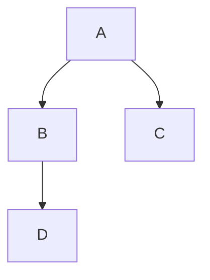
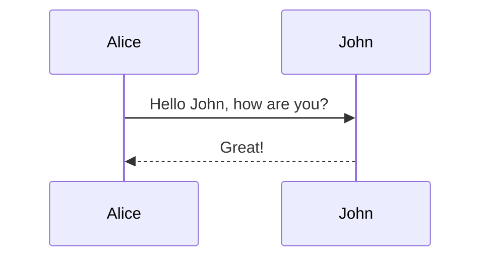
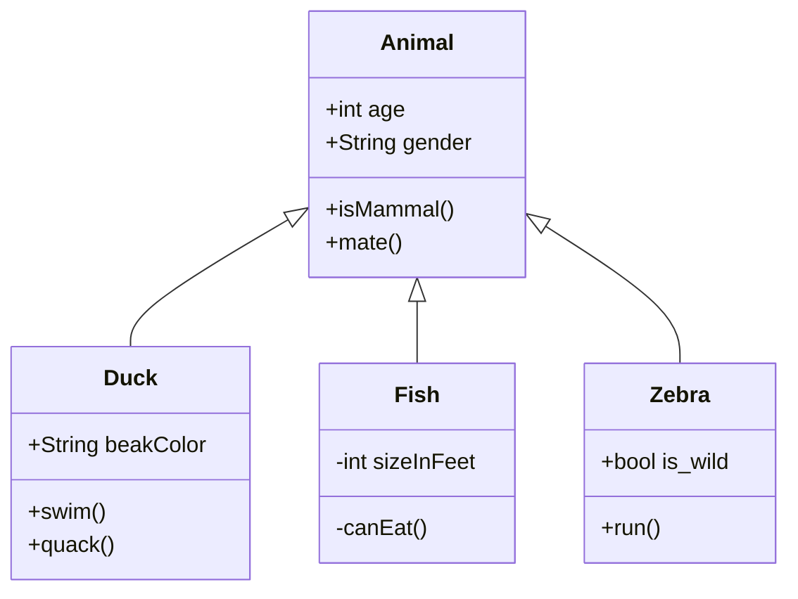
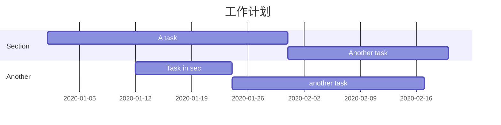
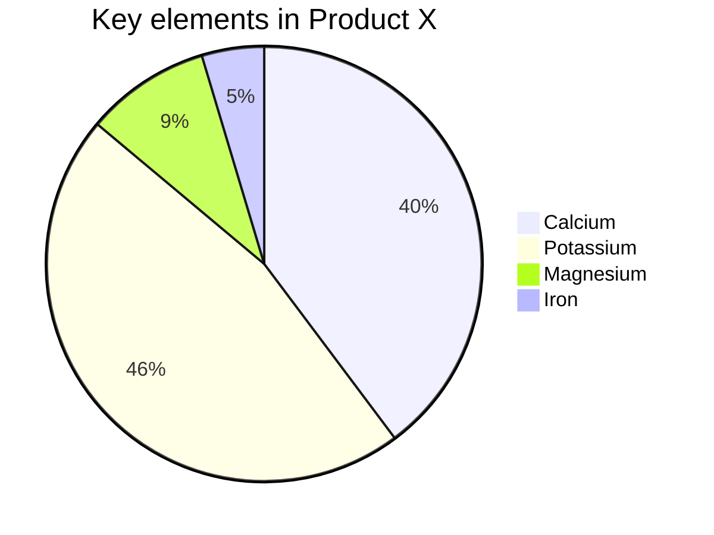

# 如何使用Typora 画图

## 1、在偏好设置中Markdown拓展语法选择图表


## 2、初始化空白图片

先在Typora中插入代码块,然后在右下角中输入Mermaid，即可初始化一张空白图片。


## 3、流程图

在空白图中输入graph等操作命令，这里TD表示top to down 由上至下。

```c
graph TD;
	A-->B;
	A-->C;
	B-->D;
```



## 4、时序图

使用sequenceDiagram,实线是一个减号表示，虚线则是两个减号。

```c
sequenceDiagram
	Alice->>John: Hello John, how are you?
	John-->>Alice: Great!
```



## 5、状态图

使用stateDiagram表示,[*]表示开始或者结束，如果在箭头的右边则表示结束。

```c
stateDiagram
	[*] --> s1
	s1 --> [*]
```


## 6、类图

使用classDiagram表示,<|--表示继承，+表示public,-表示private。

```c
classDiagram
	Animal <|-- Duck
	Animal <|-- Fish
	Animal <|-- Zebra
	Animal : +int age
	Animal : +String gender
	Animal : +isMammal()
	Animal : +mate()
	class Duck{
		+String beakColor
		+swim()
		+quack()
	}
	class Fish{
		-int sizeInFeet
		-canEat()
	}
	class Zebra{
		+bool is_wild
		+run()
	}
```



## 7、甘特图

使用gantt来表示，一般用来表示项目的计划和排期,由上至下依次是图片标题、日期格式、项目、项目细分的任务。

```c
gantt
	title 工作计划
	dataFormat YYYY-MM-DD
	section Section
	A task				:al, 2020-01-01, 30d
	Another task		:after al , 20d
	section Another
	Task in sec			:2020-01-12 , 12d
	another task		: 24d
```



## 8、饼图

使用pie表示，标题下面分别是区域名称及其百分比。

```c
pie
	title Key elements in Product X
	"Calcium"	:	42.96
	"Potassium"	:	50.05
	"Magnesium"	:	10.01
	"Iron"		:	5
```



